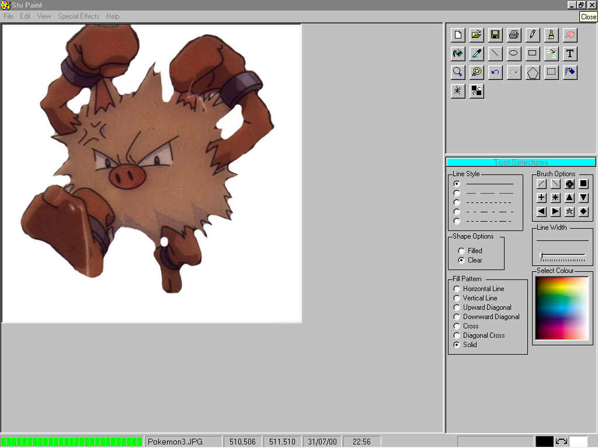



## Stu Paint V2

### Description

Stu Paint Version 2.0.4

This program has 18 filters/effects, polygon-drawing tool, zoom, fill, ellipse, and rectangle

pencil, 12 brushes, 3 different styles of TEXT (3D, Raised, Outlined), Spray, Stipple, Steal

Colour, Blur, Line, Clone, Trace. There are Vertical and horizontal rulers available, the

Progress bar can be switched off to speed up filters. There are various colour selection tools,

Change line width and fill type, Select Twain device and scan images, also print / Save / Load.

Capture Background Screen (Behind Paint Form), 5 undo events and 1 Redo, Cut / Copy / Paste.

Click the icon between the colour selections in the status bar to swap button colours.
 
### More Info
 
To use the clone tool place the mouse at the area on the picture to be cloned, then hold ALT

and left click, then the next time you click the mouse it will copy from the area where you

pressed the ALT key and clicked.

To use the Trace tool click on it then move it away from the Main Picture, then just use the

mouse Left button then trace out onto the Trace form, when complete click on finish - this will

transfer the traced image to the main picture.

The Spray and Stipple will be effected by the Line width Setting, the spray area will be larger

and the stipple lines will be longer.

All other tools are self-explanatory.

             |
---                |---
**Submitted On**   |2000-07-31 23:04:26
**By**             |[STUART LISHMAN](https://github.com/Planet-Source-Code/PSCIndex/blob/master/ByAuthor/stuart-lishman.md)
**Level**          |Advanced
**User Rating**    |4.9 (94 globes from 19 users)
**Compatibility**  |VB 5\.0, VB 6\.0
**Category**       |[Complete Applications](https://github.com/Planet-Source-Code/PSCIndex/blob/master/ByCategory/complete-applications__1-27.md)
**World**          |[Visual Basic](https://github.com/Planet-Source-Code/PSCIndex/blob/master/ByWorld/visual-basic.md)
**Archive File**   |[CODE\_UPLOAD8469812000\.zip](https://github.com/Planet-Source-Code/stuart-lishman-stu-paint-v2__1-10284/archive/master.zip)

